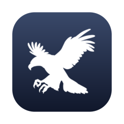
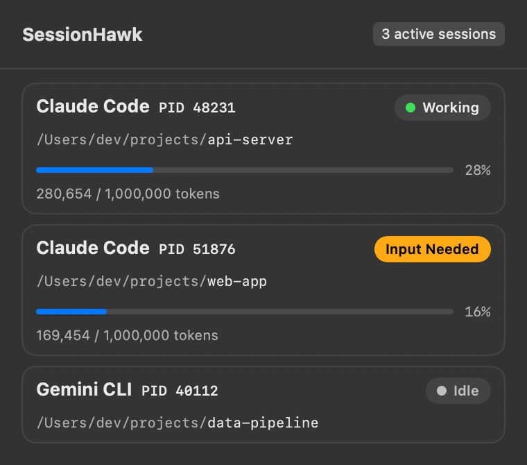

<p align="center">
  
</p>

<h1 align="center">SessionHawk 🦅</h1>

<p align="center">
  <b>A native macOS menu bar app that watches all your AI coding agents at once.</b><br>
  Know instantly which session needs your input, which is working, and how much context each one has burned.
</p>

<p align="center">
  <a href="https://buymeacoffee.com/jcsuen"></a>
  
  
  
</p>

<p align="center">
  
</p>

---

Running four Claude Code sessions, a Gemini CLI, and a Codex agent across a dozen terminal tabs? SessionHawk keeps a hawk in your menu bar so you stop cmd-tabbing through terminals to check "is it done? is it stuck? is it waiting on me?"

## Features

- **⚡ Instant "Input Needed" alerts** — native macOS notifications the moment an agent finishes a turn or hits a permission prompt. Powered by real Claude Code hooks, not polling guesswork.
- **🎯 Click to jump to the exact terminal tab** — resolves the session's TTY and focuses the right iTerm2 session or Terminal.app tab, not just the app.
- **📊 Live context usage** — real token consumption parsed from session transcripts, with 200k/1M context windows auto-detected. Watch the bar turn red before compaction sneaks up on you.
- **🔍 Auto-discovery** — finds running `claude`, `gemini`, `codex`, and `cursor-agent` processes automatically. No per-session setup.
- **🧠 Self-correcting states** — Working / Input Needed / Idle reconciled from transcript activity every 30 seconds, so a missed event never leaves a stale badge. Sessions waiting on background tasks aren't falsely flagged as needing you.
- **🪶 Native and lightweight** — pure SwiftUI + Network framework. No Electron, no dependencies, ~500 KB binary.
- **⬆️ Update notice** — the app checks daily for new releases and shows a one-click update banner.
- **📈 Daily token counter** — "Today: 1.2M tokens · 840 turns" right in the header, parsed from your local transcripts.
- **🏆 Daily leaderboard (opt-in)** — put a nickname in `~/.sessionhawk/leaderboard` and compete on [who's flying the most agents today](https://paulobuilds.com/sessionhawk/leaderboard). Nickname and tallies only.

## How it works

```
┌────────────────┐  Claude Code hooks (Stop / Notification /   ┌─────────────────┐
│  your agent    │  UserPromptSubmit / PostToolUse)            │   SessionHawk    │
│  CLI sessions  │ ───────────────────────────────────────────▶│   menu bar app   │
└────────────────┘         POST localhost:9422/v1/event        └─────────────────┘
        ▲                                                               ▲
        │        ┌──────────────────────────────┐                       │
        └────────│  feeder (30s reconciler):    │───────────────────────┘
                 │  process discovery, context  │
                 │  tokens, state self-healing  │
                 └──────────────────────────────┘
```

- **Hooks** give precise, instant state transitions (and fire the notifications).
- **The feeder** discovers sessions, parses context usage from transcripts, and reconciles state from transcript activity — only hooks may claim "Input Needed", so background monitors never cause false alarms.
- Anything can report a session: `POST http://localhost:9422/v1/event` with `{pid, provider, state, inputTokens, ...}` — trivial to integrate custom agents.

## Install

**One command** (Apple Silicon, macOS 14+):

```bash
curl -fsSL https://raw.githubusercontent.com/jcsuen/SessionHawk/main/install.sh | bash
```

That's the whole setup. It downloads the pre-built app from [Releases](https://github.com/jcsuen/SessionHawk/releases) into `/Applications`, **wires the Claude Code hooks automatically** (merged into `~/.claude/settings.json` with a timestamped backup — nothing of yours is overwritten), and sets up start-at-login for the app and the session feeder. Requires `jq` (installed via Homebrew if missing).

Uninstall just as easily:

```bash
/Applications/SessionHawk.app/Contents/Resources/scripts/uninstall.sh
```

<details>
<summary><b>Build from source / manual setup</b></summary>

```bash
git clone https://github.com/jcsuen/SessionHawk.git
cd SessionHawk
./install.sh        # detects the clone and builds instead of downloading
```

Prefer to wire things yourself? `./scripts/make-app-bundle.sh` builds and installs the app only; `./scripts/install-hooks.sh` merges just the hooks; the hooks JSON it produces adds `sessionhawk-claude-hook.sh` to `UserPromptSubmit`/`PostToolUse` (→ working), `Stop`/`Notification` (→ waitingForInput), and `SessionEnd` (→ idle), all async. `./scripts/feed-live-sessions.sh` runs the feeder in the foreground; `launchd/` has start-at-login templates.

</details>

> Already-running Claude Code sessions load hooks at startup — open `/hooks` once in each (or restart them) to activate. New sessions work immediately.

## Provider support

| Provider | Detected how | Presence | State (Working / Input Needed) | Context % | Tab focus |
|---|---|:-:|:-:|:-:|:-:|
| **Claude Code** | hooks + `claude` process scan | ✅ | ✅ instant (hooks) + self-healing (transcript activity) | ✅ from transcripts, 200k/1M auto-detected | ✅ |
| **Gemini CLI** | command-line scan (`node …/bin/gemini`) | ✅ | — | — | ✅ |
| **Codex CLI** | command-line scan (`…/bin/codex`) | ✅ | — | — | ✅ |
| **Cursor agent** | command-line scan (`…/bin/cursor-agent`) | ✅ | — | — | ✅ |
| **Anything else** | `POST /v1/event` | ✅ | ✅ if you report it | ✅ if you report it | ✅ |

Claude Code gets the deep integration because it exposes lifecycle hooks and on-disk transcripts. The other CLIs are auto-discovered by the feeder scanning running processes — you see *that* they're running, where, and can jump to their terminal tab; state/context columns light up for any tool that POSTs to the local API (see below). Gemini/Codex state adapters are on the roadmap — PRs welcome.

## HTTP API

| Endpoint | Method | Purpose |
|---|---|---|
| `/v1/event` | POST | Report a session: `{"pid": 123, "provider": "claude", "state": "working", "inputTokens": 50000, "outputTokens": 200, "totalLimit": 1000000, "workingDirectory": "/path", "timestamp": 1753960000000}` — omit `state` for a heartbeat that refreshes liveness/tokens without touching state |
| `/v1/sessions` | GET | Current sessions as JSON |

States: `working`, `waitingForInput`, `idle`, `error`. Providers: `claude`, `gemini`, `codex`, `cursor`, `custom`.

## Privacy

The update check (daily, and once at install) requests `paulobuilds.com/sessionhawk/version` with **the app version string only**. Country-level counts are aggregated at the edge; no IPs, machine identifiers, usernames, or paths are sent or stored. Opt out of the install ping with `SESSIONHAWK_NO_TELEMETRY=1`; the app's update check can be silenced by blocking `paulobuilds.com` — nothing breaks. The leaderboard is **off unless you create `~/.sessionhawk/leaderboard`** with a nickname; it then submits nickname + daily output-token/turn tallies + live agent count (keyed by a random install id, never your username or paths) — delete the file to leave. Session data (what your agents are doing) **never leaves your machine** — the IPC server binds to localhost only.

## Support

If SessionHawk saves you from one more "oh no, it's been waiting for me for 20 minutes" — consider fueling development:

<a href="https://buymeacoffee.com/jcsuen"></a>

## License

[PolyForm Noncommercial 1.0.0](LICENSE) — free to use, modify, and share for any noncommercial purpose. Commercial use requires a separate license; get in touch.
